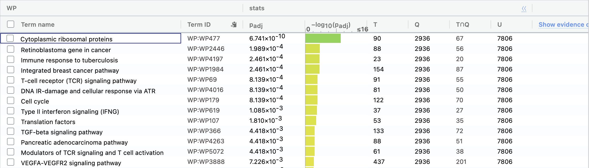
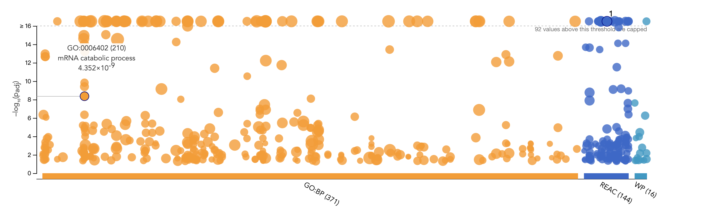

The setup of the tile part imitated the assignment I did for STA303. 

Codes are adapted from BCB420 lecture slides.

Note: The theme adding technique used idea in Lecture 7 and link: https://www.datadreaming.org/post/r-markdown-theme-gallery/ and Lecture 7.

*The link to Journal for A2:* https://github.com/bcb420-2022/Xinyi_Xu/wiki/10.-Differential-Gene-expression-and-Preliminary-ORA

# Introduction

The raw data set we used was obtained from [GEO](https://www.ncbi.nlm.nih.gov/geo/)[@Geo] with id GSE152641[@GSE152641], the name of the article is: Transcriptomic Similarities and Differences in Host Response between SARS-CoV-2 and Other Viral Infection, the raw data contained 20460 observations with 87 variables, containing RNA sequence information of 62 COVID-19 patients and 24 healthy individuals. The paper looked into the difference of RNA sequencing and gene expreesion difference for healthy individuals and Covid-19 patients. The ensembl id was mapped to entrezgene id in the provided raw data.\newline

We cleaned the data by removing duplicated and unwanted observations. Then by plotting box plots and density plots before and after we perform TMM normalization on our cleaned data, we noticed a significant difference between normalized and un-normalized data. We then transfer the entrez_id into the hgnc_symbol or corresponding gene name for the normalized data set and checked for duplicates and removed them again. Eventually we got our processed data which has 14413 observations. \newline


```{r setup, message=FALSE, warning=FALSE}
# We first setup the work space by loading all sthe packages needed, we would 
# install them if they are outdated or not installed. 
if (!requireNamespace("BiocManager", quietly = TRUE))
    install.packages("BiocManager")
if (!requireNamespace("GEOquery", quietly = TRUE))
    BiocManager::install("GEOquery")
if (!requireNamespace("biomaRt", quietly = TRUE))
    BiocManager::install("biomaRt")
if (!requireNamespace("knitr", quietly = TRUE))
    BiocManager::install("knitr")
if (!requireNamespace("AnnotationDbi", quietly = TRUE))
    BiocManager::install("AnnotationDbi")
if (!requireNamespace("annotate", quietly = TRUE))
    BiocManager::install("annotate")
if (!requireNamespace("edgeR", quietly = TRUE))
    BiocManager::install("edgeR")
if (!requireNamespace("ComplexHeatmap", quietly = TRUE))
    BiocManager::install("ComplexHeatmap")
if (!requireNamespace("circlize", quietly = TRUE))
    BiocManager::install("circlize")
if (!requireNamespace("limma", quietly = TRUE))
    BiocManager::install("limma")
if (!requireNamespace("ggplot2", quietly = TRUE))
    install.packages("ggplot2")
if (!requireNamespace("EnhancedVolcano", quietly = TRUE))
    BiocManager::install("EnhancedVolcano")

# Import the packages we need.  
library("BiocManager")
library("GEOquery")
library("biomaRt")
library("knitr")
library("AnnotationDbi")
library("annotate")
library("edgeR")
library("ComplexHeatmap")
library("circlize")
library("limma")
library("ggplot2")
library("EnhancedVolcano")
```

```{r Data loading, message=FALSE, warning=FALSE}
# We load the processed data we had created in Assignment 1 and skim it. 
normalized_count_data <- read.table(file="normalized_count_data.txt",
                                    header = TRUE,sep = "\t",
                                    stringsAsFactors = FALSE,
                                    check.names=FALSE)
kable(normalized_count_data[1:5,1:5], type="html", caption = 
        "Table1. Data normalized_count_data Skim")
```

```{r grouping process, message=FALSE, warning=FALSE}
# Following code were adapted from A1.
gn <- rep("Healthy" ,times=18)
gn1 <- rep("Covid19" ,times=62)
gn <- append(gn, gn1)
gn1 <- rep("Healthy" ,times=6)
gn <- append(gn, gn1)

# Create the required data frame.
covid_group <- data.frame(gn)
colnames(covid_group) = "Group"
rownames(covid_group) = colnames(normalized_count_data[,
                                                      4:ncol(normalized_count_data)])
covid_group <- data.frame(Sample = rownames(covid_group), Group = covid_group$Group)
```


# Differential Gene Expression
## Skim on Original Heatmap
```{r Heatmap original, message=FALSE, warning=FALSE}
# We create the heatmap. Codes were adapted from lecture 6. 
heatmap_matrix <- normalized_count_data[,
                        4:ncol(normalized_count_data)]
rownames(heatmap_matrix) <- normalized_count_data$ensembl_gene_id
colnames(heatmap_matrix) <- gn


# We scale the matrix
heatmap_matrix <- t(scale(t(heatmap_matrix)))

# We add color to our heatmap
if(min(heatmap_matrix) == 0){
  heatmap_col = colorRamp2(c( 0, max(heatmap_matrix)), c( "white", "red"))
} else {
  heatmap_col = colorRamp2(c(min(heatmap_matrix), 0,
                             max(heatmap_matrix)), c("blue", "white", "red"))
}
# Heatmap name and column_title idea come from links: https://www.biostars.org/p/388583/
# https://jokergoo.github.io/ComplexHeatmap-reference/book/a-single-heatmap.html#row-and_column_orders
# Originally ran on local machine, the heatmap was correctly output
# However, on docker image, the size of the heatmap may be too big, 
# Crashing keeps on happening, so the following code was commented out. 

# current_heatmap <- Heatmap(as.matrix(heatmap_matrix),
#       show_row_dend = TRUE,show_column_dend = TRUE,
#       col=heatmap_col,show_column_names = TRUE,
#       show_row_names = FALSE,show_heatmap_legend = TRUE, 
#       column_title = "Fig1. Heatmap Before Analysis", name = "Color Key")
# 
# current_heatmap
```


A clearer picture of Fig1 is: 


We used the ComplexHeatmap[@ComplexHeatmap] together with circlize[@circlize] to generate the above heatmap. The heatmap above illustrated the gene layout for all 86 patients before we perform further cleaning and analysis.  we could witness that there is a difference in pattern for healthy individuals and Covid-19 patients, especially the last several covid-19 patients have a dramatic difference in gene expression with the healthy individuals. (The y label of the heatmap would be clearer if viewed using show new window in R.). 

Note: The way of adding imiage consulted the link: https://www.earthdatascience.org/courses/earth-analytics/document-your-science/add-images-to-rmarkdown-report/


## Model 

### Limma

By observing Figure 1, we noticed that if the individual is COVID-19 patient or not would affect the gene pattern. So modeling based on group would be a good idea. 
```{r limma1, message=FALSE, warning=FALSE}
# The following codes are adapted from Lecture 6 with slight modification. 
filtered_matrix <- as.matrix(normalized_count_data[, 4:ncol(normalized_count_data)])
rownames(filtered_matrix) <- normalized_count_data$Gene_name

# Create model based on matrix
model_design <- model.matrix(~covid_group$Group)

# Plot MDS
# Following codes are adpated from A1
# The idea of adding legends come from https://www.geeksforgeeks.org/add-legend-to-plot-in-r/
d <- DGEList(counts = filtered_matrix, group = covid_group$Group)
d <- estimateDisp(d, model_design) 

plotMDS(d, labels=rownames(covid_group$Sample),
        col = c("#006994","#9b1c31")[factor(covid_group$Group)], 
        main = "Fig2. Distances between Samples after Normalization")
legend(x = "topleft", box.col = "#A7E7E0",
       bg ="#ffcccb", box.lwd = 1 , cex = 0.75, title="Group", 
       legend=c("Covid-19", "Healthy"), 
       fill = c("#006994","#9b1c31"))
```
\newline

Like in A1, we used package edgeR[@edgeR1; @edgeR2] to generate the plot for our normalized data. The above plot (Fig2.) is slightly different from the plot we generated in A1, which clearly shows us that after normalization, there is a difference between un-normalized and normalized data. But the overall pattern is similar which we still have Healthy controls clustering on the left side, while most Covid-19 individuals cluster on the right. \newline

So I believe it would be a good idea to choose the individual is healthy or not as a factor. \newline

### P-value calculation for Limma model
```{r limma2, message=FALSE, warning=FALSE}
# The following codes are adapted from Lecture 6 with slight modification. 
expressionMatrix <- as.matrix(normalized_count_data[,4:ncol(normalized_count_data)])
rownames(expressionMatrix) <- normalized_count_data$entrezgene_id
colnames(expressionMatrix) <- colnames(normalized_count_data)[4:ncol(normalized_count_data)]
minimalSet <- ExpressionSet(assayData=expressionMatrix)

# We fit the model and apply empircal Bayes to calculate the  
# differential expression
fit_lim <- lmFit(minimalSet, model_design)
fit_lim2 <- eBayes(fit_lim,trend=TRUE)

topfit_lim <- topTable(fit_lim2,
                   coef=which(colnames(fit_lim2$coefficients) == 
                                "covid_group$GroupHealthy"),
                   adjust.method = "BH",
                   number = nrow(expressionMatrix))
# We merge hgnc names and gene_name into topfit table
output_hits_lim <- merge(normalized_count_data[,1:3],
                     topfit_lim,
                     by.y=0,by.x=1,
                     all.y=TRUE)
```

```{r limma p-value, message=FALSE, warning=FALSE}
# Sort the output_hits_lim by pvalue
output_hits_lim <- output_hits_lim[order(output_hits_lim$P.Value),]
kable(output_hits_lim[1:10,2:8],type="html",row.names = FALSE, caption = 
        "Table2. Data output_hits_lim skim")

# Number of genes pass through threshold p-value < 0.05
length(which(output_hits_lim$P.Value < 0.05))
# Number of genes pass through genes pass correction
length(which(output_hits_lim$adj.P.Val < 0.05))
```

#### Question: \newline
##### How many genes were significantly differentially expressed? What thresholds did you use and why? \newline

In total 7991 genes are significantly differentially expressed. The thresholds we used is $p-value < 0.05$ as we want our 
differentially expressed to be significant which in other words, in this case, we are $95%$ confident that these genes are significantly differentially expressed. 

#### Question: \newline
##### Multiple hypothesis testing - correct your p-values using a multiple hypothesis correction method. Which method did you use? And Why? How many genes passed correction? \newline

We used the adjust.method = "BH", which means the default method was used, and in this case we used Benjamini-Hochberg method to correct our p-values. \newline

According to the Lecture 6 and the description of Adjust P-values for Multiple Comparisons[@stats], Benjamini-Hochberg method controls false discovery rate, as the liklihood of a positive results would occur simply due to chance would increases when the number of tests performed increases. We would like to filter out the genes that may appear due to chance. Still a threshold of $0.05$ was used. \newline

The number of genes which passed the correction is 7009, which is decent, this means there is strong signal present. \newline

The number of genes is really large, we believe there is no need to add another variable. 

### Volcano Plot for Limma model
As the original research paper listed that CD14+ monocytes has changes in the same direction consistently across viral infections, I would pay attention to gene name CD14 in the following research. 
```{r Volcano Plot limma, message=FALSE, warning=FALSE}
# The following volcano plotting generating strategy immitated the following 
# links: https://biocorecrg.github.io/CRG_RIntroduction/volcano-plots.html
# https://www.bioconductor.org/packages/release/bioc/vignettes/EnhancedVolcano/inst/doc/EnhancedVolcano.html#download-the-package-from-bioconductor
# https://training.galaxyproject.org/training-material/topics/transcriptomics/tutorials/rna-seq-viz-with-volcanoplot-r/tutorial.html#create-volcano-plot
# We first create the data set.
volcano_lim <- data.frame(gene_name = output_hits_lim$Gene_name, 
                          log2FC = output_hits_lim$logFC, 
                          log10Pneg = output_hits_lim$P.Value)

color <- data.frame(x1=rep(0,2), y1=rep(0,2), colo = c("Other" = "00FFFFFF", "CD14" = "00FFFFFF"))
# We plot a volcano plot on scratch. As the graph is not colored or further 
# analyzed.
# The idea of highlighting point come from link:
# https://stackoverflow.com/questions/14351608/color-one-point-and-add-an-annotation-in-ggplot2
# and https://stackoverflow.com/questions/46674546/how-to-add-a-custom-legend-to-plot-with-ggplot
ggplot(data = volcano_lim, aes(x=output_hits_lim$logFC, y=(-log10(output_hits_lim$P.Value)))) +
         labs(title = "Fig3. The Brief Volcano Plot of the Limma model", x = "logFC",
              y = "-log10(P.Value)") + geom_point(colour="#767676") +
   geom_point(data=volcano_lim[which(output_hits_lim$Gene_name == "CD14"), ],
             aes(x=log2FC,
                 y=log10Pneg), colour='#FADA5E', label = "CD14") +  
  geom_point(data=color, aes(x1, y1, colour=colo)) + theme_minimal() +
  scale_color_manual(name='Legend',
                     breaks=c('Other', 'CD14'),
                     values=c('Other'='#767676', 'CD14'='#FADA5E')) 


# I choose to use the EnhancedVolcano package from BiocManager to make it clearer
EnhancedVolcano(volcano_lim,
                lab = volcano_lim$gene_name,
                x = "log2FC",
                y = "log10Pneg",
                title = "Fig4. The Volcano Plot of the Limma model
                (by EnhancedVolcano)", 
                shape = c(1, 4, 23, 25))
```
\newline

The Volcano Plot for the Limma model is not as clear as we hoped it to be, from the ggplot we get, we could have a closer look at the volcano plot, where there is a logFC value at -5000 fold change, one at above 1500 fold change and most other genes gather around the interval $0-300$ and $(-300)-0$. While according to the EnhancedVolcano(Fig4)[@EnhancedVolcano], we could witness that there are several genes being listed out, the gene names are PBXIP1, EIF4B, RPLP2, SIN and so on, they might be the genes that exceed the boundary. While our gene of interest: CD14, is near the origin, which means it is significant. By comparing with the EnhancedVolcano plot gives us a clearer view, that CD14 could be significant which is desired.\newline


A clearer picture of Fig4 is: 


### Heatmap after Limma Modeling
```{r Heatmap Limma, message=FALSE, warning=FALSE}
# We extract the rownames of our significant genes. The 0.05 threshold shows a 
# Significantly amount of genes, so I changed it accoding to Lecture 6 to 0.01.
# Which also gives us 4754 number of genes which is also a lot. And this would 
# Give us a clearer figure. 
# The following code immitated the codes in Lecture 6.
top_hits_lim <- output_hits_lim$entrezgene_id[output_hits_lim$P.Value<0.01]
heatmap_matrix_tophits <- heatmap_matrix[which(rownames(output_hits_lim) %in% top_hits_lim),]

# We grep the group we want. This could be omitted, because the colnames are 
# correctly coded and do not need to modify. 
heatmap_matrix_tophits<- heatmap_matrix_tophits[, c(grep("Healthy", 
                                                         colnames(heatmap_matrix_tophits),
                                                         ),
                                                    grep("Covid", colnames(heatmap_matrix_tophits),
                                                         ))]
# We add color to our heatmap
if(min(heatmap_matrix_tophits) == 0){
  heatmap_col = colorRamp2(c(0, max(heatmap_matrix_tophits)),c( "white", "red"))
} else {
  heatmap_col = colorRamp2(c(min(heatmap_matrix_tophits), 0,
                             max(heatmap_matrix_tophits)), c("blue", "white", "red"))
}

# We generate the heatmap for the limma model 
current_heatmap_lim <- Heatmap(as.matrix(heatmap_matrix_tophits),
                           cluster_rows = TRUE, cluster_columns = TRUE,
                           show_row_dend = TRUE, show_column_dend = TRUE,
                           col=heatmap_col, show_column_names = TRUE,
                           show_row_names = FALSE, show_heatmap_legend = TRUE,
                           column_title = "Fig5. Heatmap After Limma Analysis",
                           name = "Color Key")
current_heatmap_lim
```

A clearer picture of Fig5 is: 


#### Question 
##### Do you conditions cluster together? Explain why or why not. \newline

The conditions cluster changed, but the overall pattern remained similar as it was in Fig1. We could see on the amount of Covid-19 individuals which clustered on right side remained almost the same number, with a around $-5$ Color Key for top right section. The Covid-19 individuals clustered mostly at the two ends, and the healthy individuals cluster mostly in the middle. Though the signal is not very strong, we could notice that there may be a difference caused by the group.\newline

### EdgeR

### P-value calculation for QLF
```{r p-values for EdgeR, message=FALSE, warning=FALSE}
# We perform a GLM fit and perform the differential expression 
# using the Quasi liklihood model. Codes are adapted from Lecture 6. 
fit_glm <- glmQLFit(d, model_design)
qlf.covid_vs_healthy <- glmQLFTest(fit_glm, coef="covid_group$GroupHealthy")
kable(topTags(qlf.covid_vs_healthy), type="html",row.names = FALSE, 
      caption = "Table3. Data qlf.covid_vs_healthy skim")
# We then get all the results and 
qlf.covid_vs_healthy_hits <- topTags(qlf.covid_vs_healthy,sort.by = "PValue",
                           n = nrow(normalized_count_data))
# Number of genes pass through threshold p-value < 0.05
length(which(qlf.covid_vs_healthy_hits$table$PValue < 0.05))
# Number of genes pass through genes pass correction
length(which(qlf.covid_vs_healthy_hits$table$FDR < 0.05))

# We create the output_hits_pat data for further use in producing heatmap.
output_hits_pat <- merge(normalized_count_data[,3],
                         qlf.covid_vs_healthy_hits
                         ,by.y=0,by.x=1,all.y=TRUE)
colnames(output_hits_pat)[1] = "Gene_name"
output_hits_pat <- merge(output_hits_pat, normalized_count_data[1:3], by="Gene_name",all.x=TRUE)
```
In order for it to be statistically significant, we want $p-value < 0.05$, thus the thresholds we use here is $p-value < 0.05$, as we would like to have genes that are statistically significant for differential expression. \newline

#### Question: \newline
##### How many genes were significantly differentially expressed? What thresholds did you use and why? \newline

In total 7802 genes are significantly differentially expressed. The thresholds we used is $p-value < 0.05$ as we want our 
differentially expressed to be significant which in other words, in this case, we are $95%$ confident that these genes are significantly differentially expressed. 

#### Question: \newline
##### Multiple hypothesis testing - correct your p-values using a multiple hypothesis correction method. Which method did you use? And Why? How many genes passed correction? \newline

According to the output of $?edgeR::topTags$, we noticed that the adjust.method = "BH", which means the default method was used, and in this case we used Benjamini-Hochberg method to correct our p-values. \newline

According to the Lecture 6 and the description of Adjust P-values for Multiple Comparisons[@stats], Benjamini-Hochberg method controls false discovery rate, as the liklihood of a positive results would occur simply due to chance would increases when the number of tests performed increases. We would like to filter out the genes that may appear due to chance. Still a threshold of $0.05$ was used. \newline

The number of genes which passed the correction is 6854, which is decent, strong signal could be observed.. \newline

### Volcano Plot for QLF
```{r Volcano Plot QLF, message=FALSE, warning=FALSE}
# The following volcano plotting generating strategy immitated the following 
# links: https://biocorecrg.github.io/CRG_RIntroduction/volcano-plots.html
# https://www.bioconductor.org/packages/release/bioc/vignettes/EnhancedVolcano/inst/doc/EnhancedVolcano.html#download-the-package-from-bioconductor
# https://training.galaxyproject.org/training-material/topics/transcriptomics/tutorials/rna-seq-viz-with-volcanoplot-r/tutorial.html#create-volcano-plot
# We first create the data set.
volcano_qlf <- data.frame(gene_name = output_hits_pat$hgnc_symbol, 
                          log2FC = output_hits_pat$logFC, 
                          log10Pneg = output_hits_pat$FDR)

# We plot a volcano plot on scratch. As the graph is not colored or further 
# analyzed.
ggplot(data = volcano_qlf, aes(x=output_hits_pat$logFC, 
                               y=(-log10(output_hits_pat$FDR)))) + 
         labs(title = "Fig6. The Brief Volcano Plot of the QLF", x = "logFC", 
              y = "-log10(FDR)") + geom_point(colour="#767676") +
  geom_point(data=volcano_qlf[which(output_hits_pat$hgnc_symbol == "CD14"), ],
             aes(x=log2FC, y=(-log10(log10Pneg))), colour='#FADA5E', label = "CD14") + 
  geom_point(data=color, aes(x1, y1, colour=colo)) + theme_minimal() +
  scale_color_manual(name='Legend',
                     breaks=c('Other', 'CD14'),
                     values=c('Other'='#767676', 'CD14'='#FADA5E')) 

# I choose to use the EnhancedVolcano package from BiocManager to make it clearer
EnhancedVolcano(volcano_qlf,
                lab = volcano_qlf$gene_name,
                x = "log2FC",
                y = "log10Pneg",
                title = "Fig7. The Volcano Plot of the QLF
                (by EnhancedVolcano)", 
                shape = c(1, 4, 23, 25))
```
\newline

The Volcano Plot for the QLF is much clearer than Limma model, from the ggplot we get, we could have a closer look at the volcano plot, the dots spread out from the origin like a fountain. While according to the EnhancedVolcano(Fig4)[@EnhancedVolcano], we could witness that there are several genes being listed out, the gene names are TUBB2A, ALOX15, ADAM23, H2BC6 and so on they might be the genes that exceed the boundary. While our gene of interest: CD14, is not far away from the origin, which means it is significant. By comparing with the EnhancedVolcano plot gives us a clearer view, that CD14 could be significant which is desired.\newline


A clearer picture of Fig7 is: 


```{r Heatmap After, message=FALSE, warning=FALSE}
# The following code immitated the codes in Lecture 6.
top_hits_qlf <- output_hits_pat$entrezgene_id[output_hits_pat$FDR<0.05]
heatmap_matrix_tophits_qlf <- heatmap_matrix[which(rownames(output_hits_pat) %in% top_hits_qlf),]

# We grep the group we want. This could be omitted, because the colnames are 
# correctly coded and do not need to modify. 
heatmap_matrix_tophits_qlf<- heatmap_matrix_tophits_qlf[, c(grep("Healthy", 
                                                         colnames(heatmap_matrix_tophits_qlf),
                                                         ),
                                                    grep("Covid", colnames(heatmap_matrix_tophits_qlf),
                                                         ))]

# We add color to our heatmap
if(min(heatmap_matrix_tophits_qlf) == 0){
  heatmap_col = colorRamp2(c(0, max(heatmap_matrix_tophits_qlf)),c( "white", "red"))
} else {
  heatmap_col = colorRamp2(c(min(heatmap_matrix_tophits_qlf), 0,
                             max(heatmap_matrix_tophits_qlf)), c("blue", "white", "red"))
}

# We generate the heatmap for the QLF 
current_heatmap_qlf <- Heatmap(as.matrix(heatmap_matrix_tophits_qlf),
                           cluster_rows = TRUE, cluster_columns = TRUE,
                           show_row_dend = TRUE, show_column_dend = TRUE,
                           col=heatmap_col, show_column_names = TRUE,
                           show_row_names = FALSE, show_heatmap_legend = TRUE,
                           column_title = "Fig8. Heatmap After QLF",
                           name = "Color Key")
current_heatmap_qlf
```
\newline

#### Question 
##### Do you conditions cluster together? Explain why or why not. \newline

The conditions cluster changed slightly, but the overall pattern is very similar as it was in Fig1 and Fig5. The amount of Covid-19 individuals which clustered on right side still remained almost the same number, with a around $-5$ Color Key for top right section. The Covid-19 individuals clustered mostly at the two ends, and the healthy individuals cluster mostly on the lefter middle. But the signal is not very strong.


A clearer picture of Fig8 is: 


## Limma vs QLF

```{r limma vs QLF, message=FALSE, warning=FALSE}
# The following codes are adapted from Lecture 6 with slight modification
# Create the data frame and add the colour element 
qlf_pat_model_pvalues <- data.frame(
          entrez_id = output_hits_pat$entrezgene_id,
          qlf_patient_pvalue=output_hits_pat$PValue)
limma_pat_model_pvalues <-  data.frame(
          entrez_id = output_hits_lim$entrezgene_id,
          limma_patient_pvalue = output_hits_lim$P.Value)
two_models_pvalues <- merge(qlf_pat_model_pvalues,
                            limma_pat_model_pvalues,
                            by.x=1,by.y=1)
two_models_pvalues$colour <- "#000316"
two_models_pvalues$colour[two_models_pvalues$qlf_patient_pvalue
                          <0.05] <- "#c56f39"
two_models_pvalues$colour[two_models_pvalues$limma_patient_pvalue
                          <0.05] <- "#2e8b57"
two_models_pvalues$colour[two_models_pvalues$qlf_patient_pvalue
                          <0.05 &
two_models_pvalues$limma_patient_pvalue<0.05] <- "#9b1c31"

# We plot the plot and add legends correspounding to our variables. 
# For the pch we consulted the website: https://r-lang.com/pch-in-r/
plot(two_models_pvalues$qlf_patient_pvalue,
     two_models_pvalues$limma_patient_pvalue,
     col = two_models_pvalues$colour,
     xlab = "QLF patient model p-values",
     ylab ="Limma Patient model p-values",
     main="Fig9. QLF vs Limma")
# Legend added according to the layout of the plot
legend(x = "topright", inset=c(0,0), box.col = "#A7E7E0",
       bg ="#ffcccb", box.lwd = 1 , cex = 0.75, title="Type", 
       legend=c("Pvalues>0.05", "Qlf pvalue < 0.05", "Limma pvalue < 0.05", 
                "Both < 0.05"), 
       col = c("#000316", "#c56f39", "#2e8b57", "#9b1c31"),
       pch = c(1, 1, 1, 1)
)
```

```{r limma vs QLF CD14, message=FALSE, warning=FALSE}
# We want to make a clearer graph. 
# Setup the data frame
ensembl_of_interest <- normalized_count_data$entrezgene_id[
  which(normalized_count_data$Gene_name == "CD14")]
two_models_pvalues$colour <- "grey"
two_models_pvalues$colour[two_models_pvalues$entrez_id
                          ==ensembl_of_interest] <- "#71100f"
# Plot the plot and points out our gene of interest and add legend 
# according to the variables.
plot(two_models_pvalues$qlf_patient_pvalue,
     two_models_pvalues$limma_patient_pvalue,
     col = two_models_pvalues$colour,
     xlab = "QLF patient model p-values",
     ylab ="Limma Patient model p-values",
     main="Fig10. QLF vs Limma with CD14 listed out")
points(two_models_pvalues[
  two_models_pvalues$entrez_id==ensembl_of_interest,2:3],
       pch=24,  col="#71100f", cex=1.5)
# Legend added according to the layout of the plot
legend(x = "topright", inset=c(0,0), box.col = "#A7E7E0",
       bg ="#ffcccb", box.lwd = 1 , cex = 0.75, title="Gene", 
       legend=c("Other", "CD14"), 
       col = c("grey", "#71100f"),
       pch = c(1, 24))
```
\newline

The CD14 point is in the bottom left corner, which indicates that CD14 is significant for both QLF and Limma model which is desired. \newline

## Concluting Answer

### Question 
##### Calculate p-values for each of the genes in your expression set. How many genes were significantly differentially expressed? What thresholds did you use and why? \newline

The p-values of genes are calculated, for limma model, 7991 genes were significantly differentially expressed, for QLF, 7802 genes were significantly differentially expressed. Detailed answers are in the sections of limma model and QLF respectively.

### Question 
##### Multiple hypothesis testing - correct your p-values using a multiple hypothesis correction method. Which method did you use? And Why? How many genes passed correction? \newline

The method used is Benjamini-Hochberg method. 7009 genes passed correction for limma model, and 6854 genes passed correction for QLF. Detailed answers are in the sections of limma model and QLF respectively.

### Question 
##### Show the amount of differentially expressed genes using an MA Plot or a Volcano plot. Highlight genes of interest. \newline

Graph and detailed answers are in the sections of limma model and QLF respectively.

### Question 
##### Visualize your top hits using a heatmap. Do you conditions cluster together? Explain why or why not. \newline

According to the three heatmaps we have produced, we could witness that the Covid group clusters at the two ends of the Heatmap, while the healthy group cluster majorly in the middle of the graph. By observing the patterns for all three graphs, we notice that there may be a difference of gene expressions for Covid-19 group and healthy group. But the cluster is not very strong for all three heatmaps, this may due to the large amount of gene we are visulizing and the difference of individuals. Detailed graphs are in previous sections. \newline

# Thresholded over-representation analysis

## Upregulate

```{r Upregulate, message=FALSE, warning=FALSE}
# Check the number of upregulated gene
length(which(qlf.covid_vs_healthy_hits$table$FDR < 0.05 & 
               qlf.covid_vs_healthy_hits$table$logFC > 0))

# Store the upregulated gene in a variable, in total 4132 
upregulated <- rownames(qlf.covid_vs_healthy_hits$table[which(qlf.covid_vs_healthy_hits$table$FDR < 0.05 &
                                                                qlf.covid_vs_healthy_hits$table$logFC > 0), ])
```

## Downregulate

```{r Downregulate, message=FALSE, warning=FALSE}
# Check the number of Downregulate gene
length(which(qlf.covid_vs_healthy_hits$table$FDR < 0.05
             & qlf.covid_vs_healthy_hits$table$logFC < 0))

# Store the Downregulate gene in a variable, in total 2722
downregulated <- rownames(qlf.covid_vs_healthy_hits$table[which(qlf.covid_vs_healthy_hits$table$FDR < 0.05 &
                                                                qlf.covid_vs_healthy_hits$table$logFC < 0), ])
```

## File creation
```{r table creation, message=FALSE, warning=FALSE}
# The following codes are adapted from Lecture 7 with slight modification
# We create the rank data set.
qlf.covid_vs_healthy_hits_rank <- merge(normalized_count_data[,3],
                                        qlf.covid_vs_healthy_hits
                                        ,by.y=0,by.x=1,all.y=TRUE)
colnames(qlf.covid_vs_healthy_hits_rank)[1] = "Gene_name"

# Add the column rank
qlf.covid_vs_healthy_hits_rank[, "rank"] <- -log(qlf.covid_vs_healthy_hits_rank$PValue, base = 10) * 
  sign(qlf.covid_vs_healthy_hits_rank$logFC)
qlf.covid_vs_healthy_hits_rank <- qlf.covid_vs_healthy_hits_rank[order(qlf.covid_vs_healthy_hits_rank$rank), ]

# We create a variable that hold both upregulated gene and downregulated gene
# In total 6854
sigdiff_genes <- rownames(qlf.covid_vs_healthy_hits$table[which(
  qlf.covid_vs_healthy_hits$table$FDR < 0.05), ])

# We write the table of upregulated gene
write.table(x=upregulated,
            file=file.path("covid_upregulated_genes.txt"), sep = "\t",
            row.names = FALSE, col.names = FALSE, quote = FALSE)
# We write the table of downregulated gene
write.table(x=downregulated,
            file=file.path("covid_downregulated_genes.txt"), sep = "\t",
            row.names = FALSE, col.names = FALSE, quote = FALSE)
# We write the table of downregulated gene
write.table(x=sigdiff_genes,
            file=file.path("covid_sigdiff_genes.txt"), sep = "\t",
            row.names = FALSE, col.names = FALSE, quote = FALSE)
# We write the table of ranked file
write.table(x=data.frame(genename= qlf.covid_vs_healthy_hits_rank$Gene_name,
                         F_stat = qlf.covid_vs_healthy_hits_rank$rank),
            file=file.path("covid_ranked_genelist.txt"), sep = "\t",
            row.names = FALSE, col.names = FALSE, quote = FALSE)
```

We used the [g:Profiler](https://biit.cs.ut.ee/gprofiler/gost)[@gProfiler].

## Question 
##### Which method did you choose and why? \newline

We used the [g:Profiler](https://biit.cs.ut.ee/gprofiler/gost)[@gProfiler]. As we have done a homework assignment related g:Profiler [journal](https://github.com/bcb420-2022/Xinyi_Xu/wiki/9.-G:Profiler) in the previous week, so it would be easier for us to get our hands on it. \newline

We select Benjamini-Hochberg FDR for Significance threshold, 0.05 for User threshold; GO biological process and No electronic GO annotations for Gene Ontology; Reactome and WikiPathways for Biological Pathways. We did not use KEGG for Biological Pathways to avoid possible ambiguity. And we originally selected All results but as the number of genes is very large, errors kept on popping up and thus All results was not selected. 

## Question
##### What annotation data did you use and why? What version of the annotation are you using? \newline

The GO biological process, Reactome and WikiPathways was used. As they were described in the Lecture 7 and they have been just updated either in late 2021 or in early 2022. \newline

And they also offer a R version for [R clients](https://biit.cs.ut.ee/gprofiler_beta/page/r), by including a package called "gprofiler2"[@gprofiler2], we could graph and get the desired outcome. Detailed installation and usage is inluded in the previous link: [R client](https://biit.cs.ut.ee/gprofiler_beta/page/r). 

The version I used was: \newline
hsapiens (Human) - version: GRCh38.p13 \newline

GO:BP – annotations: BioMart \newline
classes: releases/2021-12-15 \newline

REAC – annotations: BioMart \newline
classes: 2022-1-3 \newline

WP – 20211210 \newline

## Question
##### How many genesets were returned with what thresholds? \newline

For thresholds 0.05: \newline

As we did not use the All result tab due to the large amount of gene: so the total retrun value would not equal to the total input number of genes. \newline

### SigDiff Data


For GO:BP: the total geneset is 587. The top term name: macromolecule metabolic process, Term ID: GO:0043170. \newline \newline


For REAC: the total geneset is 173. The top term name: Immune System, Term ID: REAC:R-HSA-168256. \newline \newline


For REAC: the total geneset is 30. The top term name: Cytoplasmic ribosomal proteins, Term ID: WP:WP477. \newline \newline




### Upregulated gene
\newline \newline





For GO:BP: the total geneset is 371. The top term name: cellular nitrogen compound metabolic process, Term ID: GO:0034641. \newline \newline


For REAC: the total geneset is 144. The top term name: Metabolism of RNA, Term ID: REAC:R-HSA-8953854. \newline \newline


For REAC: the total geneset is 16. The top term name: Cytoplasmic ribosomal proteins, Term ID: WP:WP477. \newline \newline


### Downregulated gene
\newline \newline


For GO:BP: the total geneset is 894 The top term name: response to external stimulus, Term ID: GO:0009605. \newline \newline


For REAC: the total geneset is 161. The top term name: Neutrophil degranulation, Term ID: REAC:R-HSA-6798695. \newline \newline


For REAC: the total geneset is 36. The top term name: Immune response to tuberculosis, Term ID: WP:WP4197.\newline \newline


## Question
##### How do these results compare to using the whole list (i.e all differentially expressed genes together vs. the up-regulated and down regulated differentially expressed genes separately)? \newline

The link which output the differentially expressed genes together is: [together](https://biit.cs.ut.ee/gplink/l/MUorrXVJSZ) \newline

The link which output the up-regulated differentially expressed genes is: [up-regulated](https://biit.cs.ut.ee/gplink/l/kEhqS7xKSM) \newline

The link which output the down-regulated differentially expressed genes is: [down-regulated](https://biit.cs.ut.ee/gplink/l/0DaebrA6Sf) \newline

From the Figures in the above section, we could witness that the results of the whole list is not a combination of the results two subsets, the total genesets for the whole list is sometimes even smaller than the genesets given by its subsets. This may due to the fact that we did not choose All result tab at the beginning of the run query due to the enormous amount of gene which caused error in g:Profiler. \newline

But there are genesets that are identical like term ID: WP:WP477, which is the top term for Reac in both differentially expressed genes together and up-regulated differentially expressed genes. \newline


# Interpretation
## Question
##### Do the over-representation results support conclusions or mechanism discussed in the original paper? \newline

We believe that the over-representation results we have got so far supports the conclusions drawn by the original paper. In the original paper[@GSE152641], on page 2, in the result section, the author argues that 771 over-expressed genes and 1,231 under-expressed genes. Among the over-expressed ones, it includes: "neutrophil activation, innate immune response, immune response to viral infection, type-I interferon signaling, and cytokine production"[@GSE152641], while for the under-expressed genes, it includes: "lymphocyte differentiation and T-cell activation and regulation"[@GSE152641]. \newline

Almost all of them appear in the results of our previous analysis of either upregulated, downregulated or whole gene list. This means that these genesets in our analysis are significant as they were selected by passing through a threshold of 0.05 while we construct our file in the previous file creation section, and that is consistant with the conclusion of the original paper.\newline

Furthermore, we could witness that many of the genes listed out in the original paper are among the top rank in our analysis outputs which furthur supports the conclusion drawn. \newline

The figure results of our analysis is visible in the Thresholded over-representation analysis section.\newline

## Question 
##### Can you find evidence, i.e. publications, to support some of the results that you see. How does this evidence support your results. \newline

In our whole list results we could witness that term ID Neutrophil degranulation and Immune System are among the top of the Reac section. The article: Severe COVID-19 Is Marked by a Dysregulated Myeloid Cell Compartment[@Jonas] stated that in the Cohort group 2 they have studied, they observe that for both mild and severe COVID-19 cases, there is an increased in neutrophils and reduce in non-classical monocytes. This supports our results, as in our results the neutrophils and immune system do change for groups between healthy individuals and COVID-19 patients and the results are significant. \newline

According to article Proteomic investigation reveals dominant alterations of neutrophil degranulation and mRNA translation pathways in patients with COVID-19[@Renuka], the author stated that by investigating 452 significant proteins from COVID-19-positive samples against the healthy ones, the most important pathways they identified using enrichment analysis were neutrophil degranulation, and mRNA translation and so on. From our results provided by whole list analysis, we could witness that we have Viral mRNA Translation in the Reac section(near the top) neutrophil degranulation at among the top of Reac section. Thus provides a support for our result. \newline

# Reference

