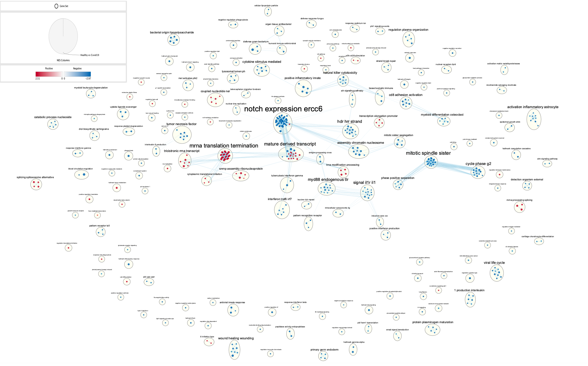

The setup of the tile part imitated the assignment I did for STA303. 

Codes are adapted from BCB420 lecture slides. 

The journal page for A3 is: https://github.com/bcb420-2022/Xinyi_Xu/wiki/12.-Data-set-Pathway-and-Network-Analysis

# Introduction

We obtained the raw data from article: Transcriptomic Similarities and Differences in Host Response between SARS-CoV-2 and Other Viral Infection, with [GEO](https://www.ncbi.nlm.nih.gov/geo/)[@Geo] id GSE152641[@GSE152641]. The data contains 20460 observations with 87 variables, there are in total 86 participants, among them, 62 are COVID-19 patients and 24 are healthy individuals. \newline

We created our normalized data set by removing duplicated and unwanted observations. Box plots and density plots were used to visualize the data and then we perform TMM normalization on our primary cleaned data, after doing so, we noticed that there is a significant difference between normalized and un-normalized data. The entrez_id used by raw data set was transferred into the hgnc_symbol or corresponding gene name for the normalized data set and duplicates were removed again. Our normalized data set has 14413 observations. \newline

Based on the normalized data, we used package limma[@limma] and edgeR[@edgeR1] [@edgeR2] to propose models and calculate the corresponding p-values. Volcano plots and heat maps are graphed for each model. We used a threshold 0.05 to identify genes that are significant, and filter out the unwanted gene names. Three txt files containing upregulate, downregulate, and ranked genes respectively were created for further analysis. \newline


Note the setup section which load packages are hided. \newline
```{r setup, message=FALSE, warning=FALSE, echo=FALSE}
# We first setup the work space by loading all the packages needed, we would 
# install them if they are outdated or not installed. 
if (!requireNamespace("BiocManager", quietly = TRUE))
    install.packages("BiocManager")
if (!requireNamespace("GEOquery", quietly = TRUE))
    BiocManager::install("GEOquery")
if (!requireNamespace("biomaRt", quietly = TRUE))
    BiocManager::install("biomaRt")
if (!requireNamespace("knitr", quietly = TRUE))
    BiocManager::install("knitr")
if (!requireNamespace("annotate", quietly = TRUE))
    BiocManager::install("annotate")
if (!requireNamespace("edgeR", quietly = TRUE))
    BiocManager::install("edgeR")
if (! requireNamespace("RCurl", quietly=TRUE)) {
    install.packages("RCurl")
}

# Import the packages we need.  
library("BiocManager")
library("GEOquery")
library("biomaRt")
library("knitr")
library("annotate")
library("edgeR")
library("RCurl")
```

```{r Data loading, message=FALSE, warning=FALSE}
# We load the ranked data we had created in Assignment 2 and skim it. 
ranked_data <- read.table(file="covid_rankedgenelist.rnk",
                                    header = TRUE,sep = "\t",
                                    stringsAsFactors = FALSE,
                                    check.names=FALSE)
kable(ranked_data[1:5,1:2], type="html", caption = "Table1. Skim on the ranked data")
```

The data set that we use for GSEA is the ranked data that we have created in Assignment 2, this data set includes all the ranked values and no threshold was applied, thus it has 14413 observations and 2 variables, the number of observations is the same as our normalized data set we have used in Assignment 2. 


# Non-thresholded Gene set Enrichment Analysis
## What method did you use? What genesets did you use? Make sure to specify versions and cite your methods.

We used GSEA pre-ranked analysis. The specific values and versions we used are: \newline \newline

**Version**: 4.2.3 \newline \newline

**Enrichment statistic**: weighted \newline \newline

**Max size**: 200 \newline \newline

**Min size**: 15 \newline \newline

**Collapse**: No_Collapse \newline \newline

The genesets we used was adapted from the [baderlab geneset](https://download.baderlab.org/EM_Genesets/)[@Bader] collection from March 1, 2021 with GOBP all pathways and no GO IEA. (Codes are documented in journal [GSEA](https://github.com/bcb420-2022/Xinyi_Xu/wiki/11.-GSEA)) \newline

## Summarize your enrichment results.

Note the idea of adding tables come from: https://bookdown.org/yihui/rmarkdown-cookbook/kable.html

                                           Table2. Layout of the Enrichment result


| Stats        |   na_pos   |  na_neg  |
|:--------------------------------------------|--------------------------------------:|--------------------------------------:|
|Upregulated   |    2205   |    3088     |
|FDR < 25%     |    323    |    1092     |
|significantly enriched at nominal pvalue < 1%|    189    |    558    |
|significantly enriched at nominal pvalue < 5%|    376    |    910    |
|Top Gene sets | EUKARYOTIC TRANSLATION INITIATION%REACTOME DATABASE ID RELEASE 79%72613 | HALLMARK_INTERFERON_ALPHA_RESPONSE%MSIGDB_C2%HALLMARK_INTERFERON_ALPHA_RESPONSE


In total 5293 gene sets are used. na_pos gene sets are genes that are upregulated in healthy human individuals, and na_neg gene sets are genes that are downregulated in healthy human individuals. \newline


                                           Table3. Top Genes Sets for na_pos and na_neg

|    Stats     |   EUKARYOTIC TRANSLATION INITIATION%REACTOME DATABASE ID RELEASE 79%72613   |  HALLMARK_INTERFERON_ALPHA_RESPONSE%MSIGDB_C2%HALLMARK_INTERFERON_ALPHA_RESPONSE  |
|:----------------------------------|--------------------------------------:|--------------------------------------:|
|Upregulated in class |    na_pos   |    na_neg    |
|Enrichment Score (ES) |    0.6688145    |    -0.8105112     |
|Normalized Enrichment Score (NES) |    2.506432    |    -2.9652746    |
|Nominal p-value |    0.0    |   0.0   |
|FDR q-value | 0.0 | 0.0 |
|FWER p-Value | 0.0 | 0.0 |
|Leading-edge | 81 | 58 |
|Top Gene | EIF4B | EPSTI1 


## How do these results compare to the results from the thresholded analysis in Assignment #2. Compare qualitatively. Is this a straight forward comparison? Why or why not?

It is not straight forward comparison, because the number of genes sets involved in GSEA and thresholded analysis is different, the total gene sets involved in thresholded analysis is 7802, while after filtering, the total GSEA gene sets used are 5293. \newline

But the results we get from thresholded analysis and GSEA are very similar. Both of the top two gene sets we get from GSEA are among the top gene sets we get from REACTOME in thresholded analysis. And by observing the top gene sets of both thresholded analysis and GSEA, they do overlap with each other, like HALLMARK_INTERFERON_GAMMA_RESPONSE%MSIGDB_C2%HALLMARK_INTERFERON_GAMMA_RESPONSE, and GTP HYDROLYSIS AND JOINING OF THE 60S RIBOSOMAL SUBUNIT%REACTOME%R-HSA-72706.2 which are the second top gene sets given by GSEA for na_neg and na_pos, are also among the top gene sets of thresholded analysis, similar examples would be: DEFENSE RESPONSE TO BACTERIUM%GOBP%GO:0042742, CYTOPLASMIC TRANSLATION%GOBP%GO:0002181 and so on. \newline

# Visualize your Gene set Enrichment Analysis in Cytoscape

We use Cytoscape[@Cytoscape] version 3.9.1 for MaxOS. Apps like EnrichmentMap[@Enrichment], and AutoAnnotate[@Autoannotate] are installed from [Cytoscape app store](https://apps.cytoscape.org/).\newline

## How many nodes and how many edges in the resulting map? What thresholds were used to create this map? Make sure to record all thresholds. Include a screenshot of your network prior to manual layout.

There are in total 534 nodes and 2771 edges. The thresholds used is listed in the figure below: The FDR q-value cutoff was set to 0.05, and all other values remained default. 


## What parameters did you use to annotate the network. If you are using the default parameters make sure to list them as well.

The plugin package used to annotate the network is: AutoAnnotate[@Autoannotate]. We used the default choice plus the Layout network to prevent cluster overlap. \newline


## Figure

We use the publication ready button in the Enrichment map section. \newline



## Collapse your network to a theme network. What are the major themes present in this analysis? Do they fit with the model? Are there any novel pathways or themes?


There are in total 173 clusters and 41 edges in both Networks. The major themes present in this analysis are: cell cycle, translation and transcription, immune response, viral life cycle, cancer, and DNA repair. \newline

We believe that the result we get matches with the model. As EUKARYOTIC TRANSLATION INITIATION%REACTOME DATABASE ID RELEASE 79%72613 is clearly gene set that is involved in translation and transcription, while HALLMARK_INTERFERON_ALPHA_RESPONSE%MSIGDB_C2%HALLMARK_INTERFERON_ALPHA_RESPONSE is a gene set that involved in immune system, and interferons are proteins which indicate that there are invaders or cancer cells in the body, and this matches with our purpose of investigation as we study the difference between healthy and Covid19 individuals. This result of GSEA is matched with our theme network, there is no clear novel pathways or themes. 


# Interpretation and detailed view of results

## Do the enrichment results support conclusions or mechanism discussed in the original paper? How do these results differ from the results you got from Assignment #2 thresholded methods?

The enrichment results support the article: Transcriptomic Similarities and Differences in Host Response between SARS-CoV-2 and Other Viral Infection[@GSE152641], as the article focused on covid 19 and other viral infections which matches with our theme: viral life cycle and immune response. Immune response and cancer was also discussed in the article where the authors claim that neutrophil-to-lymphocyte ratios are used to mark cancer severity[@Diao] [@Liu] [@Lagunas] [@Qin]. The article also stated that translation pathway like translation of ferritin is affected with COVID19 infections. Moreover, the article mentioned that genes involved in neutrophil activation, innate immune response, immune response to viral infection, type-I interferon signaling, cytokine production and lymphocyte differentiation and T-cell activation and regulation[@GSE152641] differ between healthy and Covid19 individuals, which highly matches with our enrichment results.\newline

Novel pathways is DNA repair (notch expression ercc6) which was not discussed in the article.\newline

The overall results matches with our Assignment #2 thresholded analysis results, as in our analysis in Assignment 2, we found most genes involved in the pathways mentioned above are among the top ranked genes in g:Profiler[@gProfiler] analysis. The results are consistent and do not show significant difference. The slight difference may due to the fact that the total gene sets involved in thresholded analysis is 7802, while after filtering, the total GSEA gene sets used are 5293 as we have discussed in the previous section. \newline

## Can you find evidence, i.e. publications, to support some of the results that you see. How does this evidence support your result?

Evidence and discussions that we did in Assignment #2 also supports our enrichment results. Besides that, several articles[@Diao] [@Liu] [@Lagunas] [@Qin] mentioned in the previous section, provided an evidence to supporting our result: immune response and cancer are among the major themes present in this analysis. \newline

The article[@Pablo] claims that viral infections could lead to DNA damage and might also increase the risk to cancer development, which supports our finding that there are major themes: DNA repair and cancer involved in the major themes, though DNA repair is not mentioned in our original paper. \newline


## Add a post analysis to your main network using specific transcription factors, microRNAs or drugs. Include the reason why you chose the specific miRs, TFs or drugs (i.e publications indicating that they might be related to your model). What does this post analysis show?

I choose to do post analysis on drugs. \newline

```{r Approved symbol, message=FALSE, warning=FALSE}
# Codes imitated the GSEA section
# We first download the drugbank
gmt_url = "https://download.baderlab.org/EM_Genesets/current_release/Human/symbol/DrugTargets/"
# list all the files on the server
filenames = getURL(gmt_url)
tc = textConnection(filenames)
contents = readLines(tc)
close(tc)
# get the gmt that has all the pathways and does not include terms inferred
# Human_DrugBank_approved_symbol.gmt  
rx = gregexpr("(?<=<a href=\")(.*.approved.*.)(.gmt)(?=\">)", contents,
    perl = TRUE)
gmt_file = unlist(regmatches(contents, rx))
dest_gmt_file <- file.path(gmt_file)
download.file(paste(gmt_url, gmt_file, sep = ""), destfile = dest_gmt_file)
```

### Reason
In the original paper[@GSE152641], the author mentioned that drug pegylated interferon alpha was approved by FDA using to treat HCV virus infection and previously showed a promising result when combining with ribavirin to treat MERS. In the references used by the original paper, we noticed that most references used by [@Tan] (The reference of the original paper) was related to interferon alpha2b and some of them even considered the combination of ribavirin, while [@Nile] mentioned that for MERS, usage of oral ribavirin combined with subcutaneous pegylated IFN alpha-2a resulted in noticeable improvement in the chance of survival. Thus, it would be a good idea for us to take both pegylated IFN alpha-2a and pegylated IFN alpha-2b together with ribavirin in to account while doing our post analysis, as according to our original paper, the drug has mechanisms that may be helpful in treating COVID19 (also mentioned in [@Nile]). \newline

Note, we used Mann-Whitney(one sided less) Test with a cutoff at 0.05. \newline 


### Known Signitures

The following is the value of the three drugs we get: \newline 


However, after analysis, we very unfortunately found no edges that pass the signature cutoff, and even when we expand the network, still no edges was found. This may suggests that pegylated IFN alpha-2a and pegylated IFN alpha-2b together with ribavirin may not show a similar promising result when being used to treat COVID19 as it did while being used to treat MERS.\newline


Thus we would use Exploratory post analysis to see if any other drugs has passed the cutoff. \newline


### Exploratory


We noticed that FOSTAMATINIB, GLUTAMIC ACID and PRALSETINIB are among the top drugs, which indicates that they might be the possible drug candidates being used to treat COVID19. As we explore in [Google Scholar](https://scholar.google.com/)[@Vine], we noticed that Strich[@Strich1] [@Strich2] had done a randomized trial on FOSTAMATINIB and claimed that FOSTAMATINIB shows a promising result in saving individuals who has severe disease symptoms. \newline 

While Naringenin, a drug that interact with GLUTAMIC ACID, was investigated in 2020 to treat COVID19[@Tutunchi], and PRALSETINIB was approved by FDA to treat lung and thyroid cancers[@Kim]. However, no published paper clearly indicated any promising results from clinical trials of these two drugs when being used to treat COVID19. \newline

And again, when we use the theme network, very unfortunately, we found no edges that pass the signature cutoff. Indicates that the drugs with the approved symbol from DrugBank[@Wishart] may not yield a significant result while being used to treat COVID19. \newline

However, when we expand all, we are able to witness a variety of edges linked between the nodes of our Enrichment map and the three top drugs. Among them, FOSTAMATINIB exhibits the most linkages, which indicates that the drug is a possible candidate for treating COVID19. \newline


# References


